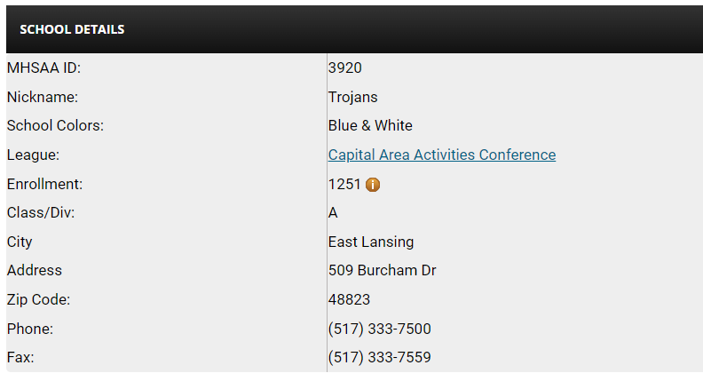
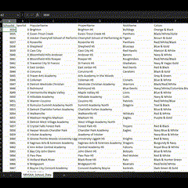
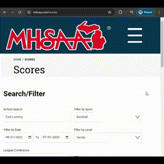
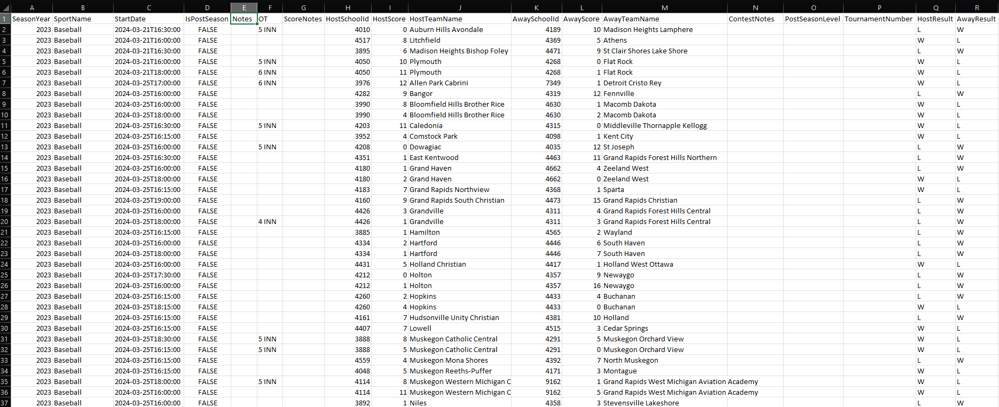

# MHSAA Statistics Project

## Table of Contents

* [Data Source and Collection](#data-sources)

## Tableau Public Link to dashboard

https://public.tableau.com/app/profile/justin.smith2295/viz/MichiganHighSchoolSportsAtlas/Main_Dash

## Data Sources:
### Michigan High School Athletics Administration [Link to Site](http://www.MHSAA.com)

### Scraping Code: 
#### Scrape and Clean School Information 
- **Target - School Info Page:** Name, address, enrollment, nickname, colors, league and *MHSAA ID*

**MHSAA_School_Info_scrape_workbook.ipynb [Link](Notebook/MHSAA_School_Info_scrape_workbook.ipynb)**
- **Data Scraping**: Extracts school details from the MHSAA website by iterating over a range of school IDs. Each school's information is fetched via a JSON response, which includes fields like school name, address, enrollment numbers, and sports details.
- **Data Transformation**: The raw JSON data for each school is parsed and transformed into a structured pandas DataFrame, making it easier to handle and analyze.
- **Efficiency**: Includes optimizations such as time delays between requests to manage server load and avoid being blocked by the website.

##### Output
- The output is a CSV file containing all collected school data, ready for further analysis or integration into other datasets.
- 

#### Scrape Sports Results (extract_data_by_sport_workbook.ipynb) [Link](Notebook/extract%20data%20by%20sport%20workbook.ipynb)
This notebook is dedicated to scraping and storing data from the Michigan High School Athletic Association (MHSAA) website. It is designed to efficiently gather results of high school sports across Michigan by automating the data collection process for various sports and academic years.

**Target: - Scores Page** to collect all avaiable results for a single sport for a single

##### Features
- **Data Scraping**: The notebook uses Python requests to pull data for entire sports seasons from the MHSAA website. Each game's data is initially captured in a single row format.
- **Data Transformation**: Converts the season-wide data into aggregated statistics for home and away teams. This transformation mimics the format used in older scraping methods where each game had separate rows for home and away perspectives.
- **Dependencies**: Utilizes libraries such as pandas, numpy, and requests for data manipulation and HTTP requests.
- **URL Handling**: Constructs URLs dynamically to fetch data based on specific dates and sports categories.

##### Output: 
- Data can be stored in one of two ways
    - **Text files** containing raw JSON data.
    - **Pandas DataFrames / CSV files** containing structured results, ready for analysis and visualization in subsequent notebooks.
    - **Example:**
    

### NCES National Center for Education Statistics
Demographic information for the schools was collected from the National Center for Education Statistics [(Homepage)](http://nces.ed.gov). Data for public schools was downloaded as a csv using the NCES' Public School Search [Link](https://nces.ed.gov/ccd/schoolsearch/) for all schools in the state of Michigan. Data for private schools was extracted the same way from the Private School section of the same site [Link](https://nces.ed.gov/surveys/pss/privateschoolsearch/)

Because each dataset included all schools in the state of all grade levels requardless of weither the school sponsered inter schoolastic competitions the data needed a substancial amount of cleaning and standarization before it could be joined with the data from the MHSAA website.

[This notebook](Notebook/Public_Private_School_Info_book.ipynb) provides a comprehensive analysis of demographic data from public and private schools. It includes data processing and visualization to compare and contrast various metrics between these two types of educational institutions.

#### Notebook Structure

- **Data Loading**: The notebook begins by loading the demographic data for both public and private schools into separate Pandas DataFrames.
- **Data Manipulation**: Several data manipulation steps are carried out to prepare the data for analysis, including adding a column to distinguish between public and private schools.
- **Data Analysis**: The notebook contains multiple cells dedicated to exploring the data, with a focus on demographic statistics and school types.
- **Visualization**: Various plots are generated to visualize comparisons between public and private schools, providing insights into their respective demographic distributions.
